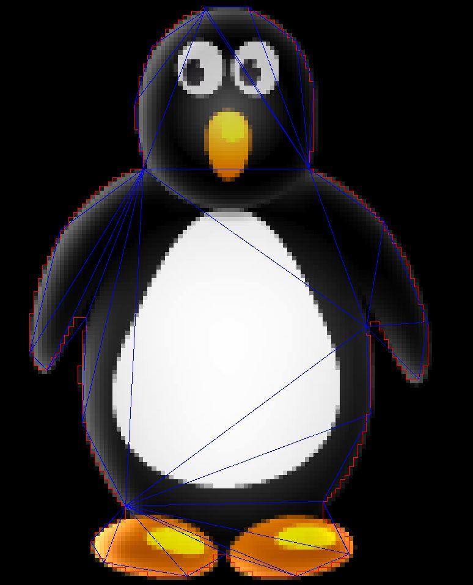

# Polygon-Triangulation

A Triangulation Algorithms made in AppGameKit

This Tool and Library can be used to create Contourlists, Polylinelists and Trianlges from one Image as input.

## Screenshots

## Videos

https://www.youtube.com/watch?v=SoqWnZJtgyw

## Requirements

You will need a copy of [AppGameKit Classic](https://store.steampowered.com/app/325180/AppGameKit_Classic_Easy_Game_Development/) or [AppGameKit Studio](https://store.steampowered.com/app/1024640/AppGameKit_Studio/) to compile this engine.
